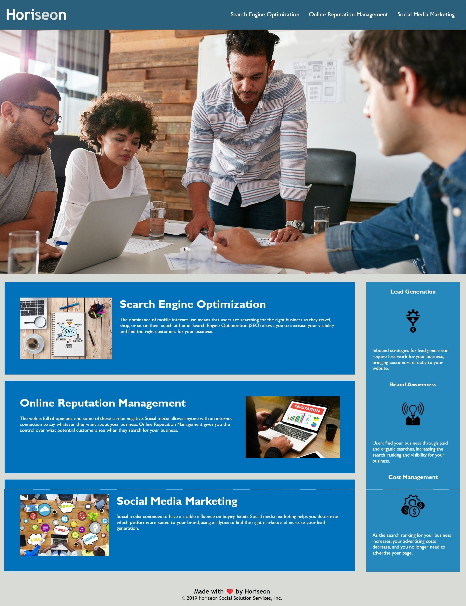

# Horiseon-website

_Improving a website's accessibilty for a fictional company 'Horiseon'_

## Description

This repo was made for making a website available to a wider audience in line with accessiblity standards. By adding semantic elements, it is now more readable to web browsers, thereby increasing the site's SEO value. In addition I have consolidated the css selectors (following the DRY principle), and added comments, to make further coding changes easier.

_Note: even though the website itself looks exactly the same, it should now be more accessible, and the code easier to read for future developers._

## Usage

_Screen readers can now use this website_

## Changes made

- Changed title to 'Horiseon'

- Fixed broken first link in nav by adding an id

- Replaced all divs with semantic elements(header, nav, aritcle, aside, section)

- Added brief alt descriptions to each img element, for screen readers

- Added a title to the hero img in html as cannot use alt on an img from css file.

- Removed an '!' from last link and </img> end tag.

- Left span element in the h1, as it serves its purporse and there is no semantic alternative

- Consolidated repetitive css selectors and classes

- Added comments to HTML and CSS to make them easier to read.

## Screenshot

## The website

This site can at <https://liamjameswatson.github.io/horiseon-website/>

## License

MIT License (Please refer to [LICENSE](LICENSE) in the repo.)
